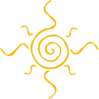

### Hi there 👋
- 🔭 I’m currently working on Institute of Physics of the Czech Academy of Science
 - Propagation of muons underground using the FLUKA Monte Carlo toolkit.
 - Work on postdoctoral research focused on the reduction of the systematic un-
certaininties stemming from the high-energy hadronic interaction models, and
muon propagation processes.
- Analysis of the observational data from the Pierre Auger Observatory, and from
NovA experiment.
- 🌱 I'm currently learning how to deal with all life variables, meanwhile:
     - Data Science in the Barcelona ITAcademy,
     - Data Science and Analytics at Universidade São Paulo
- :bowtie:
 - Omdena collaborator, IA by the people, for the people!

<!--
**zonioi/zonioi** is a ✨ _special_ ✨ repository because its `README.md` (this file) appears on your GitHub profile.

Here are some ideas to get you started:

- 🔭 I’m currently working on Institute of Physics of the Czech Academy of Science
  - Developing MonteCarlo models on high energy and ultra high energy  cosmic rays.
 
- 🌱 I'm currently learning how to deal with all life variables, also, meanwhile:
 - Data Science in the Barcelona ITAcademy,
 - Data Science and Analytics at Universidade São Paulo
 
**- 👯 I’m looking to collaborate on Data Science projects to expand my knowledge fields and have new 
- 🤔 I’m looking for help with ...
- 💬 Ask me about ...
- 📫 How to reach me: ...
- 😄 Pronouns: ...
- ⚡ Fun fact: ...
- :bowtie: 
-->
